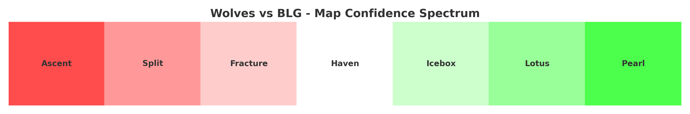

## 🇬🇧 MapSpec – Veto Prep Tool for Valorant (with JP support)

MapSpec is a pre-match **map confidence spectrum generator** for Valorant. It helps analysts make smart **pick/ban decisions** by comparing historical map performance between two teams.

You can run it via:
- ✅ Python CLI (local use)
- ✅ Google Colab (with Japanese support via `japanize-matplotlib`)

---

## 📊 Example: Confidence Spectrum


---

## 👤 Authors

| Name | GitHub | Role |
|------|--------|------|
| **Sushant Jha** | [@Ominousx](https://github.com/Ominousx) | 🧠 Project Lead / CLI Developer |
| **nolozy** | [@nolozy](https://github.com/nolozy) | 🇪・ Colab Notebook + 🇯🇵 Localization |

---

## 🛠️ Installation (Local CLI)

```bash
git clone https://github.com/Ominousx/mapspec.git
cd mapspec
pip install -r requirements.txt
```

Then run:

```bash
python3 spectrum_cli.py --wolves wolves.csv --opponent geng.csv --output spectrum.png
```

---

## ☁️ Google Colab (JP-ready)

If you're using Google Colab:

1. Create this folder structure in your **Google Drive**:
```
/My Drive
└── Colab Notebooks
    ├── Map-Confidence-Spectrum-for-GoogleColab.ipynb
    └── mapspec/
        ├── wolves.csv
        └── teams/
            └── blg/
                └── blg.csv
```

> 📌 **Important:** Folder name and CSV file name (excluding `.csv`) must match exactly.  
> Example: `/teams/blg/blg.csv`, `/teams/drg/drg.csv`, `/teams/xlg/xlg.csv`

2. Open `Map-Confidence-Spectrum-for-GoogleColab.ipynb`  
   from [@nolozy’s fork](https://github.com/nolozy/mapspec)

3. Run the notebook to generate a spectrum chart with **Japanese labels**.

---

## 🌐 Language Support

| Language | Interface | Notes |
|----------|-----------|-------|
| English  | ✅ CLI + README | Default |
| Japanese | ✅ Colab notebook (`japanize-matplotlib`) | Developed by [@nolozy](https://github.com/nolozy) |
